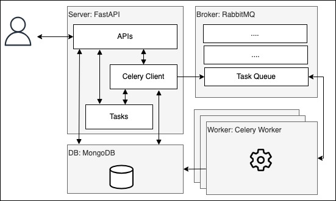

# FastAPI server + Celery for long running processes.

This is fast api project to generate thumbnail images using celery. You may replace thumbnail generator task with other long running process. 

## Table of Content

- [Requirements](#Requirements)
- [How to install and use application](How-to-install-and-use-application)
  - [Run locally](#Run-locally)
    - [Bring up the FastAPI server](#Bring-up-the-FastAPI-server)
    - [Bring up celery worker](#Bring-up-celery-worker)
  - [Run on Docker](#Run-on-Docker)
    - [Build docker images](#Build-docker-images)
    - [Run as docker containers](#Run-as-docker-containers)
  - [Run on Kind cluster](#Run-on-Kind-cluster)
    - [Deploy a kind cluster](#Deploy-a-kind-cluster)
    - [Load docker images](#Load-docker-images)
    - [Run using helm charts](#Run-using-helm-charts)
- [Testing](#Testing)
- [Technologies and architecture](#Technologies-and-architecture)
  - [Architecture](#Architecture)
  - [Technologies](#Technologies)
- [TODO](#TODO)
- [Improvements](#improvements)
- [Troubleshooting](#Troubleshooting)
- [Additional Tools used](#Additional-Tools-used)

## Requirements

### Application has been successfully run on following versions

- python 3.10
- pip 23.1.2

## How to install and use application

### Run locally

Navigate to project root directory

```bash
cd python-fastapi-server
```

Run following commands to create a python virtual env and install required packages

If any failure, check [troubleshoot](#Troubleshooting) section

```bash
python3 -m venv .venv
source .venv/bin/activate
pip3 install -r requirements.txt
```

#### Bring up the FastAPI server

Application depends on mongodb and rabbitmq. So, You may bring up mongodb and rabbitmq on docker using following commands

```bash
docker pull rabbitmq:3-management
docker run -p 5672:5672 -p 15672:15672 rabbitmq:3-management
docker pull mongo:latest
docker run -p 27017:27017 mongo:latest
```

Assuming mongodb and rabbitmq are already running on your local, export following environment variable in current terminal with correct values

```bash
export DATABASE_HOST=localhost
export DATABASE_PORT=27017
export DATABASE_NAME=test_db
export DATABASE_USER=''
export DATABASE_PASSWORD=''
```

By default, application will run on development mode with DEBUG level. Override default behavior exporting following variables in terminal.

Supported values:

- APP_CONFIG - development, production, testing
- LOG_LEVEL - INFO, DEBUG etc..

```bash
export APP_CONFIG=development
export LOG_LEVEL=DEBUG
```

To run FastAPI server execute the following command. If any failure, check [troubleshoot](#Troubleshooting) section

```bash
uvicorn server.main:app --reload --reload-dir server  --host 0.0.0.0 --port 8080
```

#### Bring up celery worker

- Open a new terminal
- cd python-fastapi-server
- Activate current virtual env (source .venv/bin/activate)
- Export following environment variables with correct values

```bash
export DATABASE_HOST=localhost
export DATABASE_PORT=27017
export DATABASE_NAME=test_db
export DATABASE_USER=''
export DATABASE_PASSWORD=''
export RABBITMQ_HOST=localhost
export RABBITMQ_PORT=5672
export RABBITMQ_USER=guest
export RABBITMQ_PASSWORD=guest
export APP_CONFIG=development
export LOG_LEVEL=DEBUG
```

Run the following command to bring up celery worker. You may change --loglevel to debug

```bash
celery -A server.celery:celery_app worker --loglevel=info
```

- Open your browser at `http://localhost:8080/docs` to see the docs.

- Open your browser at `http://localhost:15672` to see the rabbitmq dashboard.

### Run on Docker

#### Build docker images

To build Docker images, execute the following from the root directory. This command will build/pull following Docker images.

- app_nginx:0.0.1
- app_server:0.0.1
- mongo:latest
- rabbitmq:3-management

```bash
docker-compose build
```

#### Run as docker containers

This step is optional. You may proceed to [Run on Kind cluster](#Run-on-Kind-cluster)

Set required values in .env file(docker-compose uses .env by default if --env-file=FILE_PATH is not specified)

Bring up Docker containers running the following command

```bash
docker-compose up
```

- Open your browser at `http://localhost:8080/docs` to see the docs.

- Open your browser at `http://localhost:15672` to see the rabbitmq dashboard.

### Run on Kind cluster

#### Deploy a kind cluster

Kind Cluster configs can be found at ./kind/cluster.yaml. These configs deploy a kind cluster with control-plane node.

If you want to continue with default port mapping, make sure to expose 30001 and 30002 ports in your kind cluster.

- 30002 - Run fast api server
- 30001 - Run rabbitmq dashboard

```bash
kind create cluster --config kind/cluster.yaml
```

If you want to continue with your own port mapping, make sure to change nodePort of http and rabit ports in nginxSvc in ./helm/values.yaml file before execute the helm command

- nginxSvc.ports.nodePort (Both http and rabit)

#### Load docker images

Once your cluster is up and running, load locally build Docker images into the cluster by running following commands

```bash
kind load docker-image app_nginx:0.0.1
kind load docker-image app_server:0.0.1
kind load docker-image mongo:latest
kind load docker-image rabbitmq:3-management
```

#### Run using helm charts

Run the following command to deploy Docker images on kind cluster. (You may run helm command with --dry-run --debug options to validate helm charts. Ex: helm install -n \<namespace> helm-app --dry-run --debug ./helm)

```bash
helm install -n <namespace> <app-name> ./helm
```

- Open your browser at `http://localhost:<given_port>/docs` to see the docs

- Open your browser at `http://localhost:<given_port>` to see the rabbitmq dashboard

To uninstall helm charts run following command

```bash
helm uninstall  -n <namespace>  <app-name>
```

## Testing

To run tests execute the following commands in a new terminal:

If any failure, check [troubleshoot](#Troubleshooting) section

```bash
cd python-fastapi-server
source .venv/bin/activate
pip3 install -r test-requirements.txt
pytest
```

## Technologies and architecture

### Architecture

  

### Technologies

  Common reasons: All of these technologies are open-source and freely available.

- FastAPI
  
  FastAPI supports asynchronous operations with async await syntax. So that FastApi is able to achieve assignment requirements easily. Apart from that as a framework it supports fast cording, testing, automatic documentation and data validation using pydanthic. Open API documentation great feature to validate API endpoints and functionalities quickly.

- Celery

  There are so many solutions available to perform long running processes. But celery is specific because of many reasons. Celery is easy to install and integrate with FastAPI. It offloads execution from the web-app to "distributed processes" that run independently of the web-app. This is a great feature to accommodate "users will soon request other kinds of more time-consuming image
  processing"(as mentioned in the assignment doc) in the future. Also Celery can execute scheduled tasks/job with celery-beat(Not implemented now).

- RabbitMQ

  RabbitMQ guarantees message delivery and a good fit for real-time applications. Also it can be integrated with Celery by just passing broker url when create the celery instance.

- MongoDB

  Mongo can be integrated with FastAPI using python motor driver to perform async operations. And also, Mongo supports async object-document mapping with beanie.

## TODO

- Create a new user in the server/worker container(s)

  Create a new user who has less privilege than supper user in worker/server container(s) to avoid "SecurityWarning: You're running the worker with superuser privileges". User was created using Docker file with following command. Username is fastapi.

  ```bash
  RUN addgroup --system fastapi \
    && adduser --system --ingroup fastapi fastapi
  ```

  Even if the new user has been created in the worker/server containers, file upload was failed with "Errno 13 Permission denied" error. This error needs to be fixed. 

- Integrate Celery flower

  Bringing up celery flower was failed because of version miss match. So flower couldn't be integrated with the app. This needs to be done

- Add more test cases

## Improvements

- Quality

  - Unit testing, Integration testing and UAT

- HA

  - Deploy the application in HA mode and integrate with a load balancer

  - Distribute celery workers on several servers

  - Deploy MongoDB as a Replica sets

- Security

  - Enable TSL/SSL

  - User authentication

- Performance

  - Integrate caching mechanism to serve images quickly

## Troubleshooting

- If package installation is failed with "#include "longintrepr.h" error,
  - Check out [this](https://github.com/aio-libs/aiohttp/issues/6600) issue
  - Downgrade your python version to 10.x.x

- If application start-up or tests are failed with "ImportError: cannot import name 'DBRef' from 'bson'" error,

  - pip3 uninstall bson
  - pip3 uninstall pymongo
  - pip3 install pymongo

- If the application start-up is failed with "mongodb Authentication failure",

  - Check DATABASE_USER and DATABASE_PASSWORD you have given

- Check whether images successfully loaded in kind cluster.

```bash
kubectl get nodes
docker exec -it <nodename> bash
crictl images
```

- Check whether mongo user has been successfully created.

```bash
kubectl get po
kubectl exec -it <mongo-container-name> -- bash
mongosh -u mongodbuser
use admin
db.getUsers()
```

## Additional Tools used

- kompose: to generate kubernetes resource yamls from docker-compose.yaml file.

- helmify: to generate helm charts from kubernetes resource yamls

```bash
kompose convert -f docker-compose.yaml
helmify -f ./helm -r ./helm/charts
```
